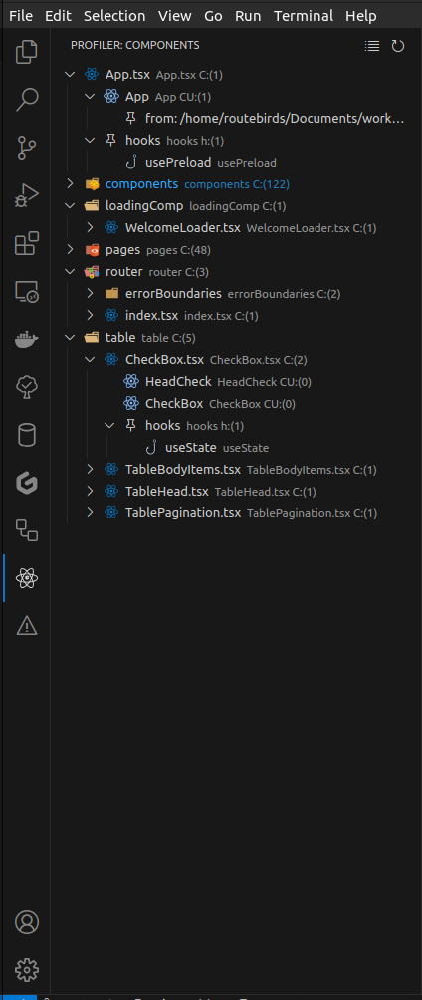

# react-component-profiler README

A vscode extension that provide statical information of your component.

## Features

- component count for every folder and file
- component usage count (count for where components are used)
- component search
- refresh
- filters  (by component files)

## Requirements
All npm packages in package.json

## Release Notes

## Following extension guidelines

Ensure that you've read through the extensions guidelines and follow the best practices for creating your extension.

* [Extension Guidelines](https://code.visualstudio.com/api/references/extension-guidelines)